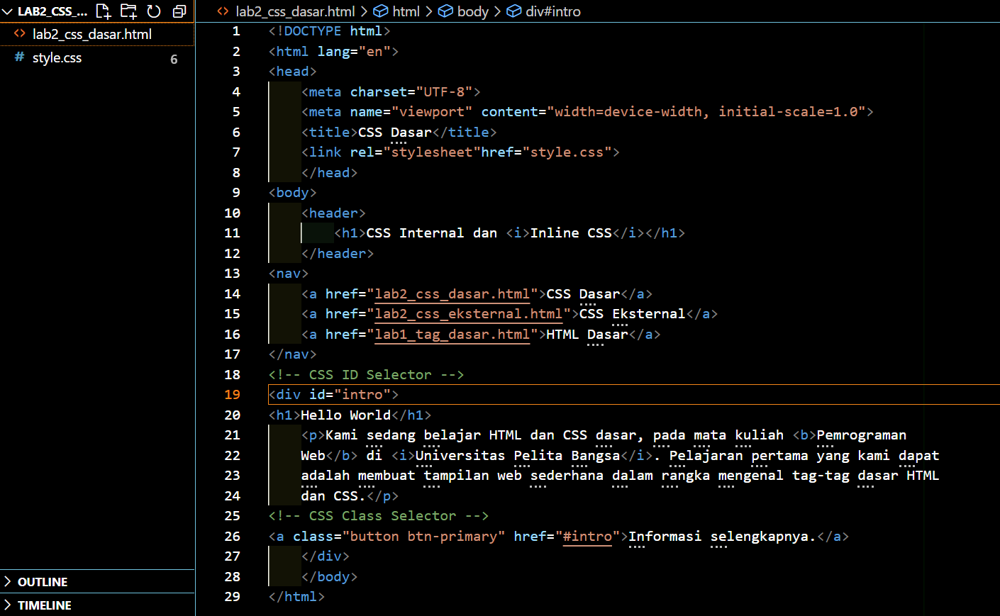
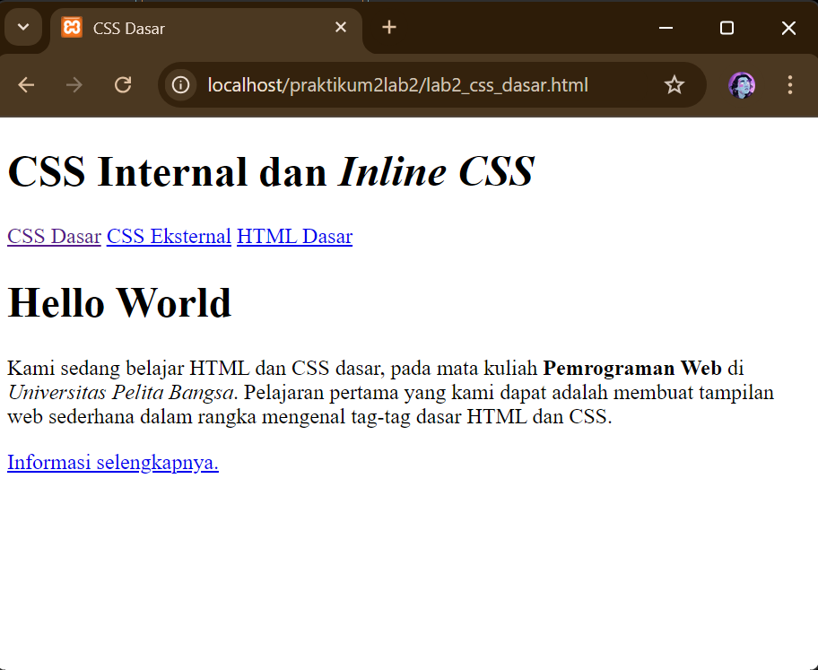
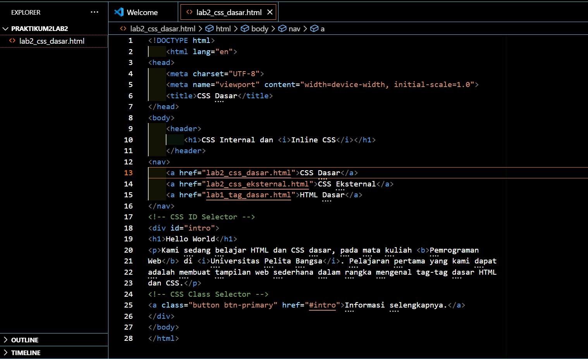
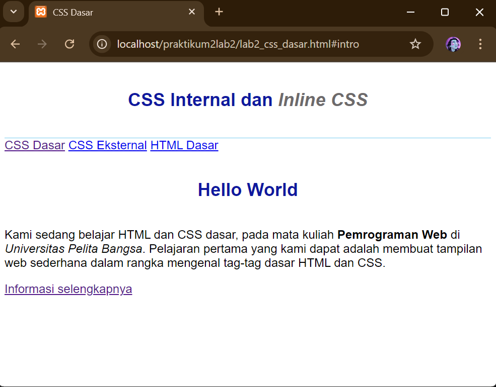
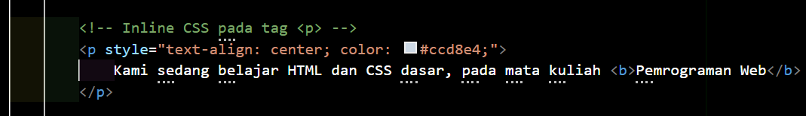
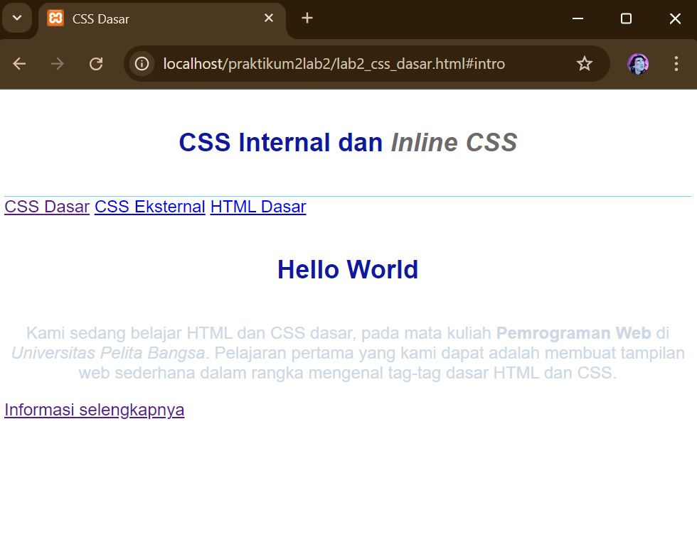
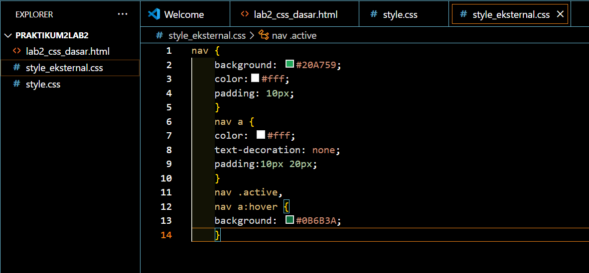
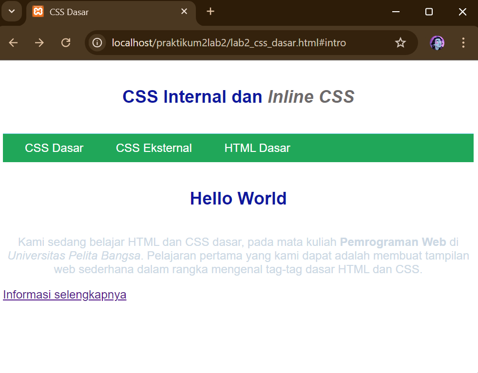
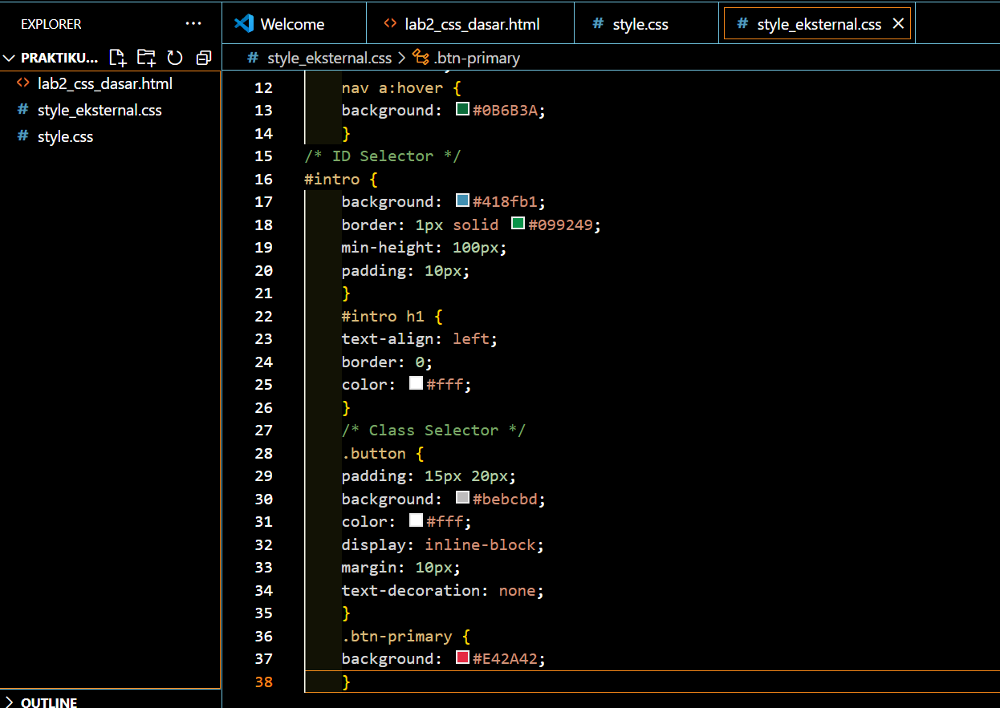
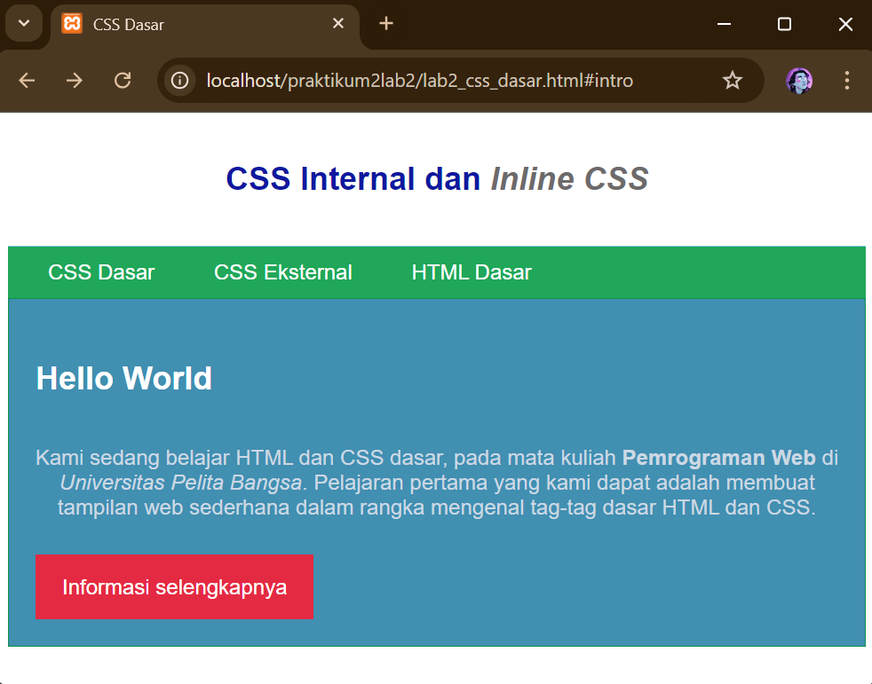

# Lab2Web
## Nama : Dewi Salsabila
## NIM  : 312310722
## Kelas : TI.23.A.4
## 1. Membuat Dokumen HTML
- CODE

- Result

## 2. Mendeklarasikan CSS
- CODE

- CODE CSS

- Result

## 3. Menambahkan inline CSS
- CODE

- Result

## 4. Membuat CSS Ekternal
- CODE

- Result

## 5. Menambahkan CSS Selector
- CODE

- Result

